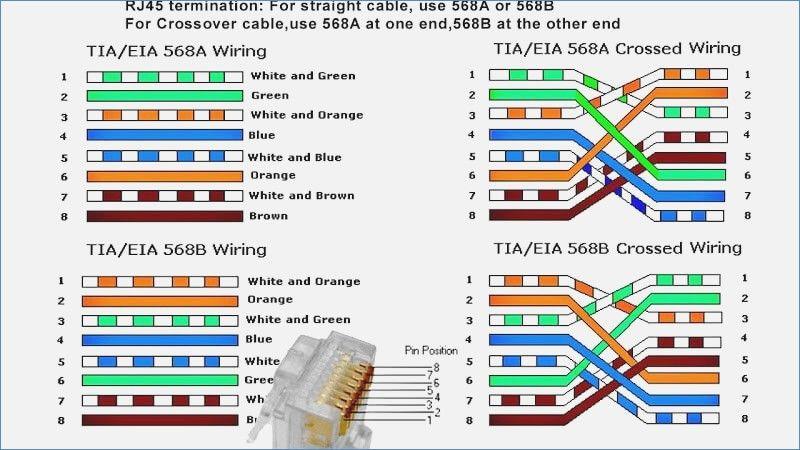

# Tugas 3 Networking Basic

### 1. Unicast adalah ?
**Unicast** adalah metode pengiriman yang konsepnya adalah “Point to Point”, Unicast biasa digunakan pada protokol : HTTP, FTP, SMTP, Telnet, DNS ,dll.

 

### 2. Multicast adalah ?
**Multicast** adalah metode pengiriman yang memiliki konsep **One to Many**. Multicast berjalan pada protokol seperti Live Streaming, Radio Online, dll. Yang dimaksud Multicast adalah komunikasi yang tidak dapat di pause. Multicast biasa digunakan untuk komunikasi routing protocol untuk mencari jalur tercepat.

| TYPE      | ASSOCIATIONS     | SCOPE           | EXAMPLE |
|-----------|------------------|-----------------|---------|
| Unicast   | 1 to 1           | Whole network   | HTTP    | 
|-----------|------------------|-----------------|---------|
| Broadcast | 1 to Many        | Subnet          | ARP     |
|-----------|------------------|-----------------|---------|
| Multicast | One/Many to Many | Defined horizon | SLP     |
|-----------|------------------|-----------------|---------|
| Anycast   | Many to Few      | Whole network   | 6to4    |

 

### 3. White-orange, Orange, White-green, Blue, White-blue, Green, White-brown, Brown merupakan tipe penyusunan pin kabel RJ-45 berjenis ?
** RJ45 Pinout T-568B **

 

### 4. Nama/jenis kabel berikut adalah : 
** RJ11 (Registered jack 11) ** / Copper Termination adalah konektor yang paling umum diterapkan untuk saluran telepon.

 

### 5. Nama/jenis kabel berikut adalah : 
** RP-TNC (Reverse-polarity Threaded Neill Concelman) ** / Wireless Antennas adalah konektor yang digunakan dalam industri seluler, avionik, unit pangkalan nirkabel, produk nirkabel konsumen, dan komunikasi militer.
